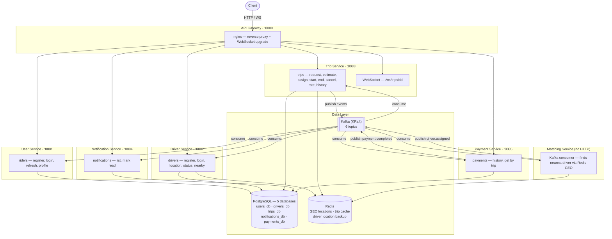

# Interview Preparation Guide — Ride-Hailing Microservices

A complete reference for discussing this project in technical interviews.
Covers system design, detailed flows, tech stack decisions, architecture, challenges, and progressive Q&A.

---

## Table of Contents

1. [Project Overview](#1-project-overview)
2. [Architecture](#2-architecture)
3. [Service Responsibilities](#3-service-responsibilities)
4. [System Flows](#4-system-flows)
5. [Tech Stack — Why Each Choice](#5-tech-stack--why-each-choice)
6. [Database Design](#6-database-design)
7. [Kafka Event Architecture](#7-kafka-event-architecture)
8. [Authentication & Authorization](#8-authentication--authorization)
9. [Key Design Decisions](#9-key-design-decisions)
10. [Challenges & Solutions](#10-challenges--solutions)
11. [Q&A — Basic Level](#11-qa--basic-level)
12. [Q&A — Moderate Level](#12-qa--moderate-level)
13. [Q&A — Advanced Level](#13-qa--advanced-level)

---

## 1. Project Overview

This is a **distributed ride-hailing backend** — similar in concept to Uber's core booking system — built as **6 Go microservices** communicating via Kafka events.

A rider requests a trip → the system finds the nearest available driver using Redis GEO → assigns them automatically via Kafka → tracks the trip through a state machine → calculates fare → processes payment → sends notifications → allows ratings.

**Key numbers:**
- 6 services + 1 matching service (Kafka-only, no HTTP)
- 5 PostgreSQL databases (one per data-owning service)
- 6 Kafka topics for event-driven communication
- 32 unit tests + E2E test suite
- 10 Docker containers (services + postgres + redis + kafka)

---

## 2. Architecture



**Data flow summary:**
- HTTP requests enter through nginx (port 8000), routed by URL prefix to the correct service
- Services communicate **only through Kafka events** — no direct service-to-service HTTP calls
- Each service owns its own database — no cross-database joins or foreign keys
- Redis is shared between trip-service, driver-service, and matching-service for GEO operations

---

## 3. Service Responsibilities

### User Service (`:8081`)
- **Owns:** `users_db` — riders table
- **HTTP:** register, login, refresh token, get profile
- **Kafka:** consumes `rating.submitted` to update rider rating averages
- **Auth:** public endpoints for register/login/refresh; rider-only for profile

### Driver Service (`:8082`)
- **Owns:** `drivers_db` — drivers table
- **HTTP:** register, login, refresh token, get profile, update location, update status, nearby search
- **Kafka:** consumes `driver.assigned` (set busy), `trip.completed` (set available), `trip.cancelled` (set available), `rating.submitted` (update rating)
- **Redis:** writes driver location to GEO set; saves backup location key

### Trip Service (`:8083`)
- **Owns:** `trips_db` — trips table + ratings table
- **HTTP:** request, estimate, assign, start, end, cancel, rate, history (rider & driver), WebSocket tracking
- **Kafka:** publishes `ride.requested`, `trip.completed`, `trip.cancelled`, `rating.submitted`; consumes `driver.assigned` (update trip status)
- **Redis:** restores driver to GEO pool on trip completion/cancellation

### Matching Service (no HTTP)
- **Owns:** nothing — stateless
- **Kafka:** consumes `ride.requested`, publishes `driver.assigned`
- **Redis:** queries GEO for nearby drivers, removes assigned driver from pool

### Notification Service (`:8084`)
- **Owns:** `notifications_db` — notifications table
- **HTTP:** list notifications (paginated), mark as read
- **Kafka:** consumes ALL 6 topics; creates notifications for relevant users

### Payment Service (`:8085`)
- **Owns:** `payments_db` — payments table
- **HTTP:** payment history (paginated), get payment by trip ID
- **Kafka:** consumes `trip.completed` (create payment), publishes `payment.completed` after async processing

---

## 4. System Flows

### 4.1 — Trip Lifecycle (Complete Flow)

```
Rider                   Trip Service          Kafka           Matching Service       Driver Service
  │                         │                   │                    │                     │
  ├─POST /trips/request────►│                   │                    │                     │
  │                         ├─INSERT trip───────►│                   │                     │
  │                         ├─publish──────────►ride.requested       │                     │
  │◄──201 {trip_id}─────────┤                   │                    │                     │
  │                         │                   ├──consume──────────►│                     │
  │                         │                   │                    ├─Redis GEO search     │
  │                         │                   │                    ├─Remove from GEO pool │
  │                         │                   │◄─publish──────────driver.assigned        │
  │                         │◄──consume─────────┤                    │                     │
  │                         ├─UPDATE trip────────┤                   │                     │
  │                         │                   ├───────────────────────consume────────────►│
  │                         │                   │                    │              SET busy│
  │                         │                   │                    │                     │
Driver                      │                   │                    │                     │
  ├─PATCH /{id}/start──────►│                   │                    │                     │
  │                         ├─UPDATE started_at─┤                   │                     │
  │◄──200 {status}──────────┤                   │                    │                     │
  │                         │                   │                    │                     │
  ├─PATCH /{id}/end────────►│                   │                    │                     │
  │                         ├─compute fare──────┤                   │                     │
  │                         ├─UPDATE completed──┤                   │                     │
  │                         ├─publish──────────►trip.completed       │                     │
  │                         ├─Restore GEO pool──┤                   │                     │
  │◄──200 {fare}────────────┤                   │                    │                     │
  │                         │                   ├───────────────────────consume────────────►│
  │                         │                   │                    │          SET available│
  │                         │                   ├──consume──────────►payment-service        │
  │                         │                   │                    │                     │
```

### 4.2 — Authentication Flow

```
User                    Service              JWT Package
  │                       │                      │
  ├─POST /register───────►│                      │
  │                       ├─validate inputs──────┤
  │                       ├─bcrypt password───────┤
  │                       ├─INSERT user──────────┤
  │                       ├─Generate(id,email,role)──►│
  │                       │◄─────────access_token (24h)│
  │                       │◄─────────refresh_token (7d)│
  │◄──201 {token, refresh_token, user}──┤        │
  │                       │                      │
  ├─GET /profile ─────────►│                      │
  │  Authorization: Bearer │                      │
  │                       ├─RequireAuth middleware──►│
  │                       │◄─claims {user_id, role}──┤
  │                       ├─RequireRole("rider")──►│
  │                       ├─fetch user───────────┤
  │◄──200 {user}──────────┤                      │
  │                       │                      │
  ├─POST /refresh─────────►│                      │
  │  {refresh_token}      ├─Validate(refresh)────►│
  │                       │◄─claims────────────────┤
  │                       ├─Generate(new access)──►│
  │◄──200 {token}─────────┤                      │
```

**Token types:**
- `access` — 24-hour expiry, sent as `Authorization: Bearer <token>`
- `refresh` — 7-day expiry, used only to get a new access token

### 4.3 — Fare Estimation

```
Rider                    Trip Service
  │                         │
  ├─POST /trips/estimate───►│
  │  {pickupLat, pickupLng, │
  │   dropLat, dropLng}     ├─haversineKm(pickup, drop)
  │                         ├─fare = (₹50 + km × ₹12) × surge
  │                         ├─duration = (km / 25) × 60 min
  │◄──200 {fare, dist, dur}─┤
```

Pure computation — no database, no Kafka. Surge defaults to 1.0.

### 4.4 — Rating Flow

```
Rider/Driver             Trip Service          Kafka         Driver/User Service
  │                         │                   │                    │
  ├─POST /{id}/rate────────►│                   │                    │
  │  {score: 5, comment}    ├─verify COMPLETED──┤                   │
  │                         ├─determine ratee───┤                   │
  │                         ├─INSERT rating─────┤ (UNIQUE constraint)│
  │                         ├─publish──────────►rating.submitted    │
  │◄──201 {rating}──────────┤                   │                    │
  │                         │                   ├──consume──────────►│
  │                         │                   │              update avg:
  │                         │                   │              new = (old×count + score)/(count+1)
  │                         │                   │              count++
```

### 4.5 — Payment Flow

```
trip.completed event
        │
        ▼
  Payment Service
        │
        ├─INSERT payment (status=PENDING)
        ├─simulate 1s processing (goroutine)
        ├─UPDATE payment (status=COMPLETED)
        ├─publish payment.completed
        │
        ▼
  Notification Service → "Payment of ₹X processed"
```

### 4.6 — Notification Triggers

| Kafka Topic | Notification Created For | Message |
|-------------|-------------------------|---------|
| `ride.requested` | Rider | "Your ride is being matched" |
| `driver.assigned` | Rider + Driver | "Driver assigned!" / "New trip assigned!" |
| `trip.completed` | Rider + Driver | "Trip completed. Fare: ₹X" |
| `trip.cancelled` | Rider (+ Driver if assigned) | "Trip cancelled" |
| `rating.submitted` | Ratee | "You received a X-star rating" |
| `payment.completed` | Rider | "Payment of ₹X processed" |

### 4.7 — Driver Matching (Detailed)

```
1. matching-service consumes ride.requested event
2. Extract pickup coordinates (lat, lng)
3. Redis GEOSEARCH: find drivers within 10km, sorted by distance, limit 1
4. If no driver found → log and skip (trip stays REQUESTED)
5. If driver found:
   a. Remove driver from Redis GEO pool (prevent double-assignment)
   b. Publish driver.assigned event with {trip_id, driver_id}
6. trip-service consumes driver.assigned → UPDATE trip SET driver_id, status=DRIVER_ASSIGNED
7. driver-service consumes driver.assigned → UPDATE driver SET status=busy
```

---

## 5. Tech Stack — Why Each Choice

| Technology | Why |
|-----------|-----|
| **Go** | Low-latency, great concurrency (goroutines for Kafka consumers), single binary deployment, strong stdlib |
| **Chi router** | Lightweight, idiomatic Go HTTP router with middleware chaining; no magic, easy to test |
| **PostgreSQL + pgx** | ACID transactions for financial data (trips, payments), pgx is the fastest pure-Go Postgres driver with connection pooling |
| **Redis** | Sub-millisecond GEO queries for driver proximity; also used for driver location backup and trip caching |
| **Kafka (KRaft)** | Decouples services, guarantees event delivery, enables independent scaling; KRaft mode eliminates ZooKeeper dependency |
| **NGINX** | Battle-tested reverse proxy; handles WebSocket upgrade, path-based routing to services |
| **JWT (HS256)** | Stateless auth — no session store needed; shared secret across services for token validation |
| **bcrypt** | Industry-standard password hashing with configurable work factor |
| **Docker Compose** | Single-command deployment for 10 containers with proper startup ordering |

---

## 6. Database Design

### Why Separate Databases?

Each service owns its database — **no cross-service joins or foreign keys**. This enables:
- Independent schema evolution per service
- Independent scaling and backup strategies
- Service isolation — one service's DB issues don't cascade

### Schemas

**users_db**
```sql
users (id UUID PK, name, email UNIQUE, phone UNIQUE, password_hash, rating FLOAT DEFAULT 5.0, rating_count INT DEFAULT 0, created_at)
```

**drivers_db**
```sql
drivers (id UUID PK, name, email UNIQUE, phone UNIQUE, password_hash, vehicle_type, license_plate, status VARCHAR DEFAULT 'offline', rating FLOAT DEFAULT 5.0, rating_count INT DEFAULT 0, created_at)
```

**trips_db**
```sql
trips (id UUID PK, rider_id, driver_id, pickup_lat, pickup_lng, drop_lat, drop_lng, fare, status, requested_at, started_at, completed_at, created_at)
ratings (id UUID PK, trip_id, rater_id, rater_role, ratee_id, ratee_role, score CHECK(1-5), comment, created_at, UNIQUE(trip_id, rater_id))
```

**notifications_db**
```sql
notifications (id UUID PK, user_id, type, title, body, read BOOL DEFAULT false, created_at)
INDEX (user_id, created_at DESC)
```

**payments_db**
```sql
payments (id UUID PK, trip_id UNIQUE, rider_id, driver_id, amount, status DEFAULT 'PENDING', payment_method DEFAULT 'cash', created_at, completed_at)
INDEX (rider_id), INDEX (driver_id)
```

### Migration Strategy

Each service embeds SQL migration files via `//go:embed`. On startup, the shared `db.RunMigrations()` function:
1. Creates `schema_migrations` tracking table if not exists
2. Reads embedded SQL files, sorts alphabetically (V1, V2, V3...)
3. Skips already-applied migrations
4. Applies new ones in order

---

## 7. Kafka Event Architecture

### Topic Design

6 topics, each representing a domain event:

```
ride.requested    → "A rider wants a ride"
driver.assigned   → "A driver was matched to a trip"
trip.completed    → "A trip finished successfully"
trip.cancelled    → "A trip was cancelled"
rating.submitted  → "Someone submitted a rating"
payment.completed → "A payment was processed"
```

### Consumer Groups

Each consuming service uses a unique consumer group ID:

| Service | Group ID | Topics |
|---------|----------|--------|
| matching-service | matching-ride-requested | ride.requested |
| trip-service | trip-driver-assigned | driver.assigned |
| driver-service | driver-status-assigned, driver-status-completed, driver-status-cancelled, driver-rating | driver.assigned, trip.completed, trip.cancelled, rating.submitted |
| user-service | user-rating-consumer | rating.submitted |
| notification-service | notif-ride-requested, notif-driver-assigned, notif-trip-completed, notif-trip-cancelled, notif-rating-submitted, notif-payment-completed | all 6 |
| payment-service | payment-trip-completed | trip.completed |

### Event Payload Examples

```json
// ride.requested
{"trip_id":"uuid","rider_id":"uuid","pickup":{"lat":12.97,"lng":77.59},"drop":{"lat":12.93,"lng":77.62},"requested_at":"2026-03-07T10:00:00Z"}

// driver.assigned
{"trip_id":"uuid","driver_id":"uuid","assigned_at":"2026-03-07T10:00:05Z"}

// trip.completed
{"trip_id":"uuid","driver_id":"uuid","rider_id":"uuid","fare":104.00,"completed_at":"2026-03-07T10:30:00Z","duration_seconds":1800}

// rating.submitted
{"trip_id":"uuid","rater_id":"uuid","rater_role":"rider","ratee_id":"uuid","ratee_role":"driver","score":5,"comment":"Great!"}

// payment.completed
{"payment_id":"uuid","trip_id":"uuid","rider_id":"uuid","driver_id":"uuid","amount":104.00,"completed_at":"2026-03-07T10:30:02Z"}
```

---

## 8. Authentication & Authorization

### Middleware Chain

```
OptionalAuth → extracts claims if token present (does not reject)
RequireAuth  → rejects 401 if no valid token
RequireRole  → rejects 403 if role doesn't match
```

Applied per-route:
- **Public:** no middleware (register, login, refresh)
- **Any authenticated user:** RequireAuth + RequireRole("rider", "driver")
- **Rider-only:** RequireAuth + RequireRole("rider")
- **Driver-only:** RequireAuth + RequireRole("driver")

### Token Structure (Claims)

```json
{
  "user_id": "uuid",
  "email": "user@example.com",
  "role": "rider",
  "token_type": "access",
  "exp": 1741363200,
  "iat": 1741276800
}
```

---

## 9. Key Design Decisions

### Why microservices over monolith?

The system was originally a monolith (`ride-service` at port 8080). It was split into microservices because:
- **Independent scaling** — matching and trip services have different load profiles
- **Fault isolation** — notification service going down shouldn't affect trip creation
- **Team ownership** — each service has a clear domain boundary
- **Technology flexibility** — payment service could use a different DB in future

### Why Kafka over direct HTTP calls?

- **Decoupling** — services don't need to know about each other's existence
- **Reliability** — if notification service is down, events queue up in Kafka
- **Fan-out** — `trip.completed` is consumed by 3 different services simultaneously
- **Ordering** — events for the same trip go to the same partition (keyed by trip_id)

### Why Redis GEO over PostGIS?

- **Speed** — sub-millisecond proximity queries vs. ~5-10ms for PostGIS
- **Simplicity** — GEOSEARCH is a single command, no spatial index management
- **Volatility is acceptable** — driver locations are transient; if Redis restarts, drivers just re-send location

### Why no foreign keys across services?

Each service owns its database. Cross-service FKs would create coupling and prevent independent deployments. Instead:
- `trips.rider_id` references user-service conceptually, not via FK
- Data consistency is maintained through Kafka events (eventual consistency)

### Driver status sync pattern

Driver status (`available` / `busy` / `offline`) is managed by driver-service consuming Kafka events:
- `driver.assigned` → busy
- `trip.completed` → available
- `trip.cancelled` → available

This prevents trip-service from writing to driver-service's database. The GEO pool (Redis) is managed by trip-service for latency reasons.

---

## 10. Challenges & Solutions

### Challenge 1: Double driver assignment

**Problem:** Two concurrent ride requests could match the same driver.

**Solution:** Matching service uses Redis ZREM to atomically remove the driver from the GEO pool before publishing `driver.assigned`. Only the first request succeeds in removing the driver; the second finds no nearby driver.

### Challenge 2: Driver location restoration after cancellation

**Problem:** When a driver is assigned, they're removed from the GEO pool. If the trip is cancelled, they need to be restored.

**Solution:** `SaveDriverLocation()` stores a backup `driver:loc:{id}` key in Redis before GEO removal. On cancellation, trip-service reads this backup and restores the driver to the GEO pool. Driver-service handles the DB status update via Kafka.

### Challenge 3: Rating average recalculation

**Problem:** Updating a running average without reading all ratings.

**Solution:** Weighted average formula: `new_rating = (old_rating × count + score) / (count + 1)`. Both `rating` and `rating_count` are stored in the DB, updated atomically in a single UPDATE.

### Challenge 4: Preventing duplicate ratings

**Problem:** A rider could rate the same trip multiple times.

**Solution:** `UNIQUE(trip_id, rater_id)` constraint on the ratings table. The INSERT fails if a rating already exists for that trip+rater combination.

### Challenge 5: Service startup ordering

**Problem:** Services crash if Kafka/Postgres aren't ready.

**Solution:** Both `db.Connect()` and `kafka.EnsureTopics()` implement retry loops (30 and 20 attempts respectively, with exponential backoff). Docker Compose `depends_on` handles container ordering.

---

## 11. Q&A — Basic Level

**Q: What happens when a rider requests a ride?**

A: The trip-service creates a trip record with status REQUESTED, then publishes a `ride.requested` event to Kafka. The matching-service consumes this event, searches Redis GEO for the nearest available driver within 10km, removes that driver from the pool, and publishes a `driver.assigned` event. The trip-service and driver-service both consume this event to update their respective records.

**Q: How does authentication work?**

A: Services use HS256 JWT tokens. On register/login, the service generates an access token (24h) and refresh token (7d). Access tokens are sent as `Authorization: Bearer <token>` headers. The shared JWT middleware validates tokens and extracts claims (user_id, role). RBAC is enforced via `RequireRole()` middleware.

**Q: Why separate databases per service?**

A: To enforce service isolation. No service can directly read/write another service's data, preventing tight coupling. Schema changes in one service don't affect others. Each database can be scaled, backed up, and maintained independently.

**Q: How are notifications generated?**

A: The notification-service subscribes to all 6 Kafka topics. When any event occurs (ride requested, driver assigned, trip completed, etc.), it creates a notification record in `notifications_db` for the relevant user(s). Users fetch their notifications via the HTTP API.

---

## 12. Q&A — Moderate Level

**Q: How do you prevent the same driver from being assigned to two trips simultaneously?**

A: The matching-service atomically removes the driver from the Redis GEO pool using ZREM before publishing `driver.assigned`. Since Redis operations are single-threaded, only one concurrent request can successfully remove a given driver. The second request's GEO search either won't find that driver or ZREM will fail.

**Q: What's the difference between access and refresh tokens?**

A: Access tokens are short-lived (24h), sent with every API request, and contain the user's ID and role. Refresh tokens are longer-lived (7d), stored client-side, and used only to obtain a new access token via the `/refresh` endpoint. Both have a `token_type` claim to distinguish them. This pattern limits the damage of a leaked access token while reducing login frequency.

**Q: How does the fare estimation work?**

A: It uses the Haversine formula to calculate great-circle distance between pickup and drop coordinates. The fare formula is `(₹50 base + ₹12 × km) × surge_multiplier`. It also estimates duration assuming 25 km/h average speed. Surge defaults to 1.0. This is a pre-trip estimate; the actual fare at trip end can use GPS-tracked distance if provided.

**Q: What happens if a service goes down?**

A: Because services communicate through Kafka (not direct HTTP calls), events accumulate in Kafka partitions. When the service comes back up, it resumes from its last committed offset and processes all missed events. The consumer group protocol ensures exactly-once processing per group. The only impact is latency — e.g., if notification-service is down, notifications are delayed but not lost.

**Q: How is the rating system designed?**

A: After a COMPLETED trip, either the rider or driver can rate via `POST /trips/{id}/rate`. The service verifies the trip is completed, determines the ratee (rider rates driver and vice versa), inserts into the ratings table (UNIQUE constraint prevents double-rating), and publishes a `rating.submitted` Kafka event. Driver-service and user-service consume this event and update their respective running averages using a weighted formula.

---

## 13. Q&A — Advanced Level

**Q: How would you scale this to handle 100K requests/second?**

A: Several approaches:
1. **Horizontal scaling** — run multiple instances of each service behind a load balancer; Kafka consumer groups auto-distribute partitions
2. **Database** — read replicas for query-heavy services (trip history, notifications), connection pooling already configured (25 max conns)
3. **Redis** — Redis Cluster for GEO operations; the single-threaded model handles ~100K ops/sec per node
4. **Kafka** — increase partitions (currently 3 per topic); more partitions = more parallel consumers
5. **Caching** — Redis trip cache reduces DB reads for hot data; could add CDN for static content

**Q: How would you handle payment failures in production?**

A: Currently, payment processing is simulated. In production:
1. Integrate with a payment gateway (Razorpay/Stripe) in the goroutine
2. Implement idempotency keys (trip_id as natural key) to prevent double charges
3. Use a saga pattern: PENDING → PROCESSING → COMPLETED/FAILED
4. Failed payments trigger a `payment.failed` event for retry logic
5. Dead letter queue for permanently failed payments requiring manual review

**Q: Why not use gRPC between services instead of Kafka?**

A: For this domain, Kafka is more appropriate because:
1. **Event fan-out** — `trip.completed` is consumed by 3 services; gRPC would require 3 separate calls
2. **Temporal decoupling** — if notification-service is deploying, events queue up; with gRPC, calls would fail
3. **Event sourcing potential** — Kafka retains events, enabling replay for debugging or new services
4. **However**, for low-latency request-response patterns (e.g., "get user profile from trip-service"), gRPC would be better. The current design avoids these cross-service calls entirely.

**Q: How do you ensure data consistency across services without distributed transactions?**

A: The system uses **eventual consistency** through Kafka events:
1. Each service maintains its own data and publishes state changes as events
2. Other services consume events and update their local state
3. Idempotent consumers handle duplicate events (e.g., UNIQUE constraints, `ON CONFLICT DO NOTHING`)
4. The trade-off: during brief windows, data may be inconsistent (e.g., trip shows COMPLETED but driver still shows "busy" until the event is consumed). This is acceptable for a ride-hailing system where sub-second consistency isn't required for most operations.

**Q: What observability would you add for production?**

A: The current system has basic logging. For production:
1. **Structured logging** — JSON logs with request IDs, trace IDs for correlation
2. **Metrics** — Prometheus metrics for request latency, Kafka consumer lag, DB pool utilization
3. **Distributed tracing** — OpenTelemetry with Jaeger to trace a request across all services
4. **Health checks** — each service already has `/health`; add liveness/readiness probes for Kubernetes
5. **Alerting** — Kafka consumer lag alerts, error rate alerts, latency P99 alerts

**Q: How would you migrate this to Kubernetes?**

A: The Docker Compose setup maps cleanly to Kubernetes:
1. Each service → Deployment + Service (ClusterIP)
2. nginx → Ingress controller (or use an API gateway like Kong)
3. PostgreSQL → StatefulSet or managed DB (RDS/Cloud SQL)
4. Redis → StatefulSet or managed Redis (ElastiCache)
5. Kafka → Strimzi operator or managed Kafka (MSK/Confluent Cloud)
6. ConfigMaps for env vars, Secrets for JWT_SECRET and DB passwords
7. HPA (Horizontal Pod Autoscaler) based on CPU/request metrics
