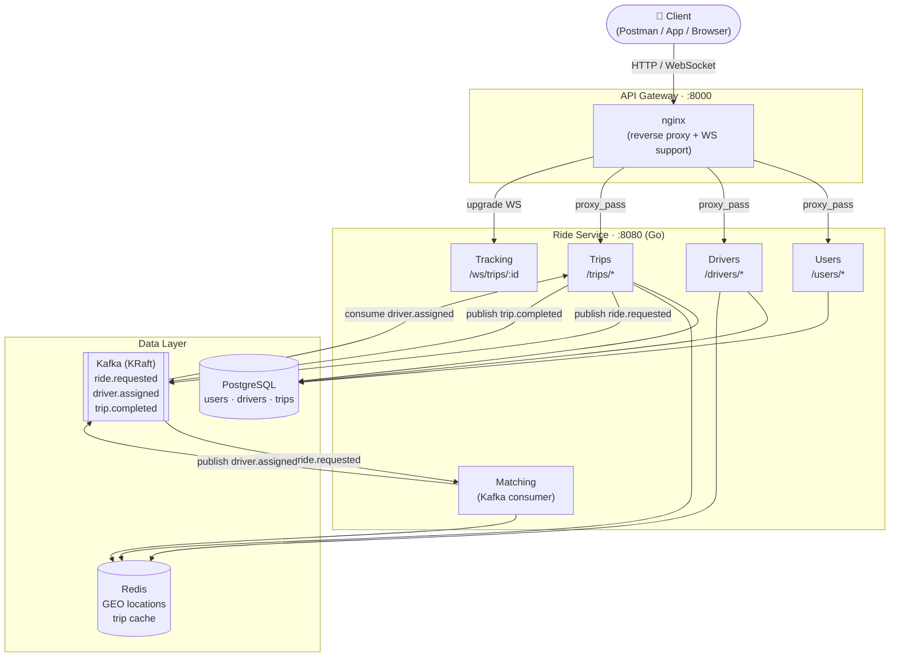

# Ride-Hailing System

Minimal distributed ride-hailing backend written in **Go**, backed by PostgreSQL, Kafka, Redis, and an NGINX API Gateway.

## Architecture



### Kafka Event Flow

```
POST /trips/request
        │
        ▼
  ride.requested ──► Matching consumer
                            │ (finds nearest driver via Redis GEO)
                            ▼
                    driver.assigned ──► Trip consumer
                                              │ (updates trip status)
                                              ▼
                                      DRIVER_ASSIGNED

PATCH /trips/:id/end
        │
        ▼
  trip.completed ──► (future: billing / analytics)
```

## Project Structure

```
├── api-gateway/          # NGINX reverse proxy
│   ├── nginx.conf
│   └── Dockerfile
├── ride-service/          # Single Go backend
│   ├── cmd/main.go
│   ├── internal/
│   │   ├── users/         # User registration, login, profile
│   │   ├── drivers/       # Driver registration, login, location
│   │   ├── trips/         # Trip lifecycle (request → complete)
│   │   ├── matching/      # Kafka consumer: ride.requested → driver.assigned
│   │   ├── tracking/      # WebSocket: /ws/trips/:id
│   │   └── events/        # Shared event structs
│   ├── pkg/
│   │   ├── db/            # PostgreSQL pool + migration runner
│   │   ├── kafka/         # Producer / consumer wrapper
│   │   ├── redis/         # GEO location + caching
│   │   ├── jwt/           # Token generation, validation, middleware
│   │   └── validation/    # Input validation (email, phone, coords, password)
│   ├── migrations/        # SQL files (auto-applied on startup)
│   ├── go.mod
│   └── Dockerfile
├── infra/
│   ├── docker-compose.yml
│   └── .env.example
├── test/
│   ├── test_all.sh        # Automated 98-test suite
│   ├── demo.sh            # End-to-end demo workflow
│   └── postman_collection.json
└── Makefile
```

## Quick Start

```bash
make up        # build & start everything
make logs      # tail ride-service logs
```

Wait ~30s for Kafka + Postgres to be ready, then the ride-service will connect and run migrations automatically.

## Services & Ports

| Service      | Host Port | URL                          |
|-------------|-----------|------------------------------|
| API Gateway | 8000      | http://localhost:8000        |
| ride-service| 8080      | http://localhost:8080        |
| PostgreSQL  | 5433      | `postgres://...@localhost:5433/ride_db` |
| Redis       | 6380      | `localhost:6380`             |
| Kafka       | 9093      | `localhost:9093` (KRaft mode) |

## Kafka Topics

| Topic            | Producer           | Consumer         |
|-----------------|--------------------|------------------|
| ride.requested  | trips (on request) | matching         |
| driver.assigned | matching           | trips            |
| trip.completed  | trips (on end)     | (future billing) |

## Run All Tests (Automated)

```bash
bash test/test_all.sh
```

This runs **98 tests** covering every endpoint, edge case, and the full Kafka matching flow. Requires `curl` and `jq`.

---

## API Reference

All requests go through the gateway at **http://localhost:8000**.

> **Tip:** Every response is JSON. Pipe any command through `| jq` for pretty output.

### Endpoints

| Method | Path | Auth | Description |
|--------|------|------|-------------|
| GET    | `/health` | — | Health check |
| POST   | `/users/register` | — | Register a rider |
| POST   | `/users/login` | — | Login as rider |
| GET    | `/users/:id` | Bearer | Get rider profile |
| POST   | `/drivers/register` | — | Register a driver |
| POST   | `/drivers/login` | — | Login as driver |
| GET    | `/drivers/:id` | Bearer | Get driver profile |
| PATCH  | `/drivers/:id/location` | Bearer | Update driver GPS |
| GET    | `/drivers/nearby` | Bearer | Find nearby drivers |
| POST   | `/trips/request` | Bearer | Request a ride |
| GET    | `/trips/:id` | Bearer | Get trip details |
| PATCH  | `/trips/:id/assign` | Bearer | Manually assign driver |
| PATCH  | `/trips/:id/start` | Bearer | Start trip |
| PATCH  | `/trips/:id/end` | Bearer | End trip + compute fare |
| GET    | `/ws/trips/:id` | — | WebSocket live tracking |

---

### 1. Health Check

```bash
curl -s http://localhost:8000/health | jq
```

**Expected (200):**
```json
{ "status": "ok", "service": "ride-service" }
```

---

### 2. User (Rider) Registration

```bash
curl -s -X POST http://localhost:8000/users/register \
  -H "Content-Type: application/json" \
  -d '{
    "name": "Sai Kumar",
    "email": "sai@test.com",
    "phone": "+919999999999",
    "password": "Pass123!"
  }' | jq
```

**Expected (201):**
```json
{
  "token": "eyJhbGciOi...",
  "user": { "id": "...", "name": "Sai Kumar", "email": "sai@test.com", "rating": 5 }
}
```

```bash
RIDER_TOKEN="eyJhbGciOi..."
RIDER_ID="a1b2c3d4-..."
```

---

### 3. User Login

```bash
curl -s -X POST http://localhost:8000/users/login \
  -H "Content-Type: application/json" \
  -d '{"email": "sai@test.com", "password": "Pass123!"}' | jq
```

---

### 4. Get User Profile

```bash
curl -s http://localhost:8000/users/$RIDER_ID \
  -H "Authorization: Bearer $RIDER_TOKEN" | jq
```

---

### 5. Driver Registration

```bash
curl -s -X POST http://localhost:8000/drivers/register \
  -H "Content-Type: application/json" \
  -d '{
    "name": "Ravi Kumar",
    "email": "ravi@test.com",
    "phone": "+918888888888",
    "password": "Driver123!",
    "vehicle_type": "suv",
    "license_plate": "KA-01-AB-1234"
  }' | jq
```

> `vehicle_type` defaults to `"sedan"` if omitted.

```bash
DRIVER_TOKEN="eyJhbGciOi..."
DRIVER_ID="d5e6f7g8-..."
```

---

### 6. Driver Login

```bash
curl -s -X POST http://localhost:8000/drivers/login \
  -H "Content-Type: application/json" \
  -d '{"email": "ravi@test.com", "password": "Driver123!"}' | jq
```

---

### 7. Update Driver Location

```bash
curl -s -X PATCH http://localhost:8000/drivers/$DRIVER_ID/location \
  -H "Authorization: Bearer $DRIVER_TOKEN" \
  -H "Content-Type: application/json" \
  -d '{"lat": 12.9716, "lng": 77.5946}' | jq
```

**Expected (200):** `{ "status": "location_updated" }`

---

### 8. Find Nearby Drivers

```bash
curl -s "http://localhost:8000/drivers/nearby?lat=12.9716&lng=77.5946&radius=5" \
  -H "Authorization: Bearer $RIDER_TOKEN" | jq
```

> `radius` defaults to `5` km if omitted.

---

### 9. Request a Trip

```bash
curl -s -X POST http://localhost:8000/trips/request \
  -H "Authorization: Bearer $RIDER_TOKEN" \
  -H "Content-Type: application/json" \
  -d '{
    "pickupLat": 12.9716,
    "pickupLng": 77.5946,
    "dropLat": 12.9352,
    "dropLng": 77.6245
  }' | jq
```

**Expected (201):** `{ "trip_id": "...", "status": "REQUESTED" }`

> Behind the scenes: trip saved → `ride.requested` Kafka event → matching consumer finds nearest driver → `driver.assigned` event → trip updated to `DRIVER_ASSIGNED`.

```bash
TRIP_ID="t1r2i3p4-..."
```

---

### 10. Get Trip Details

```bash
curl -s http://localhost:8000/trips/$TRIP_ID \
  -H "Authorization: Bearer $RIDER_TOKEN" | jq
```

---

### 11. Assign Driver (Manual)

Only works when trip is `REQUESTED` or `MATCHING`.

```bash
curl -s -X PATCH http://localhost:8000/trips/$TRIP_ID/assign \
  -H "Authorization: Bearer $RIDER_TOKEN" \
  -H "Content-Type: application/json" \
  -d "{\"driverId\": \"$DRIVER_ID\"}" | jq
```

---

### 12. Start Trip

`DRIVER_ASSIGNED` → `STARTED`

```bash
curl -s -X PATCH http://localhost:8000/trips/$TRIP_ID/start \
  -H "Authorization: Bearer $RIDER_TOKEN" | jq
```

---

### 13. End Trip

`STARTED` → `COMPLETED`. Fare computed, `trip.completed` published to Kafka.

```bash
# Auto-calculate fare (Haversine)
curl -s -X PATCH http://localhost:8000/trips/$TRIP_ID/end \
  -H "Authorization: Bearer $RIDER_TOKEN" \
  -H "Content-Type: application/json" \
  -d '{}' | jq

# Or provide explicit distance
curl -s -X PATCH http://localhost:8000/trips/$TRIP_ID/end \
  -H "Authorization: Bearer $RIDER_TOKEN" \
  -H "Content-Type: application/json" \
  -d '{"distanceKm": 25.5}' | jq
```

> **Fare formula:** `₹50 base + ₹12 × distance_km`

| Distance | Fare  |
|----------|-------|
| 4.5 km   | ₹104  |
| 10 km    | ₹170  |
| 25.5 km  | ₹356  |

---

### 14. WebSocket — Real-time Trip Tracking

```bash
# wscat
wscat -c ws://localhost:8000/ws/trips/$TRIP_ID

# websocat
websocat ws://localhost:8000/ws/trips/$TRIP_ID
```

```javascript
// Browser
const ws = new WebSocket("ws://localhost:8000/ws/trips/YOUR_TRIP_ID");
ws.onmessage = (e) => console.log(JSON.parse(e.data));
```

Messages received:
```json
{ "trip_id": "...", "lat": 12.9720, "lng": 77.5950, "ts": 1771439400 }
```

---

### 15. End-to-End Flow (copy-paste)

```bash
# Register rider
RIDER=$(curl -s -X POST http://localhost:8000/users/register \
  -H "Content-Type: application/json" \
  -d '{"name":"Test Rider","email":"rider@e2e.com","phone":"+911111111111","password":"Pass123!"}')
RIDER_TOKEN=$(echo $RIDER | jq -r '.token')
RIDER_ID=$(echo $RIDER | jq -r '.user.id')

# Register driver
DRIVER=$(curl -s -X POST http://localhost:8000/drivers/register \
  -H "Content-Type: application/json" \
  -d '{"name":"Test Driver","email":"driver@e2e.com","phone":"+912222222222","password":"Pass123!","vehicle_type":"sedan","license_plate":"KA-99-ZZ-0001"}')
DRIVER_TOKEN=$(echo $DRIVER | jq -r '.token')
DRIVER_ID=$(echo $DRIVER | jq -r '.driver.id')

# Set driver location (Bangalore)
curl -s -X PATCH http://localhost:8000/drivers/$DRIVER_ID/location \
  -H "Authorization: Bearer $DRIVER_TOKEN" \
  -H "Content-Type: application/json" \
  -d '{"lat": 12.9716, "lng": 77.5946}' | jq

# Request ride
TRIP=$(curl -s -X POST http://localhost:8000/trips/request \
  -H "Authorization: Bearer $RIDER_TOKEN" \
  -H "Content-Type: application/json" \
  -d '{"pickupLat":12.9716,"pickupLng":77.5946,"dropLat":12.9352,"dropLng":77.6245}')
TRIP_ID=$(echo $TRIP | jq -r '.trip_id')

# Wait for Kafka auto-matching
sleep 5
curl -s http://localhost:8000/trips/$TRIP_ID -H "Authorization: Bearer $RIDER_TOKEN" | jq '{status, driver_id}'

# Start → End
curl -s -X PATCH http://localhost:8000/trips/$TRIP_ID/start -H "Authorization: Bearer $RIDER_TOKEN" | jq '{status}'
curl -s -X PATCH http://localhost:8000/trips/$TRIP_ID/end \
  -H "Authorization: Bearer $RIDER_TOKEN" -H "Content-Type: application/json" \
  -d '{}' | jq '{status, fare}'
```

---

## Trip Status Lifecycle

```
REQUESTED → (Kafka matching) → DRIVER_ASSIGNED → STARTED → COMPLETED
     │                              │
     └── manual /assign ────────────┘
```

| State              | How to reach it                                      |
|--------------------|------------------------------------------------------|
| `REQUESTED`        | `POST /trips/request`                                |
| `DRIVER_ASSIGNED`  | Auto (Kafka) or `PATCH /trips/:id/assign`            |
| `STARTED`          | `PATCH /trips/:id/start`                             |
| `COMPLETED`        | `PATCH /trips/:id/end`                               |

## JWT Authentication

- Tokens valid for **24 hours**
- Include as: `Authorization: Bearer <token>`
- Roles: `rider` (user endpoints) · `driver` (driver endpoints)
- Public endpoints (no token): `/health`, `/users/register`, `/users/login`, `/drivers/register`, `/drivers/login`

## Teardown

```bash
make down      # stop containers
make clean     # stop + wipe volumes
```
