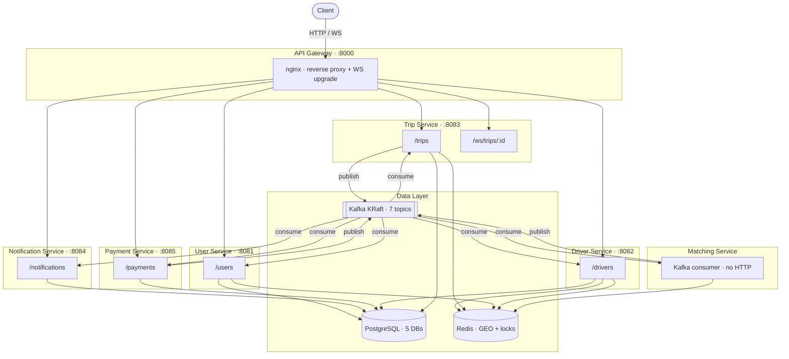

# Uber — Ride-Hailing Backend

<p align="center">
  
  
  
  
  
  
</p>

> **Live demo:** `https://api-gateway-ov0j.onrender.com` (Singapore · Render free tier — first request may take ~30 s to cold-start)

A production-style ride-hailing backend built with Go microservices, event-driven architecture (Kafka), geospatial driver matching (Redis GEO), PostgreSQL, and an NGINX API gateway — all orchestrated via Docker Compose.

---

## Table of Contents

- [Features](#features)
- [Architecture](#architecture)
- [Services](#services)
- [Kafka Topics](#kafka-topics)
- [Quick Start](#quick-start)
- [API Reference](#api-reference)
- [End-to-End Flow](#end-to-end-flow)
- [Payment Flow](#payment-flow)
- [State Machines](#state-machines)
- [Testing](#testing)

---

## Features

- **OTP-based 2FA login** — email/password + 6-digit OTP via SMTP for both riders and drivers
- **Ride OTP confirmation** — 4-digit OTP generated on driver assignment; rider shares it verbally; driver must submit it to start the trip, preventing ghost rides
- **Geospatial driver matching** — Redis GEO `GEORADIUS` search finds the nearest available driver and assigns via Kafka
- **Real-time trip tracking** — WebSocket endpoint streams live driver GPS coordinates to the rider
- **Multi-method payments** — cash (driver-confirmed), UPI (scannable QR + VPA), or Razorpay card; browser-based checkout page with real-time WebSocket completion push
- **Email notifications** — HTML emails sent on trip completion, cancellation, and payment confirmation
- **Event-driven consistency** — 7 Kafka topics decouple all services; no cross-service foreign keys
- **JWT authentication** — HS256 access tokens (15 min) + refresh tokens (7 days); role-based guards (rider / driver)
- **Vehicle categories** — `go` (hatchback), `x` (sedan, default), `xl` (SUV) with per-category base fare and per-km rate
- **Surge pricing** — fare multiplier computed server-side, capped at 5×; admin-controlled via `GET/PATCH /trips/surge`
- **Driver earnings dashboard** — `GET /payments/earnings?period=week|month|all` with daily breakdown
- **Idempotent webhook handling** — duplicate Razorpay events are no-ops

---

## Architecture


```mermaid
flowchart TD
    Client(["Client"])

    subgraph Gateway["API Gateway · :8000"]
        Nginx["nginx · reverse proxy + WS upgrade"]
    end

    subgraph UserSvc["User Service · :8081"]
        U["/users"]
    end
    subgraph DriverSvc["Driver Service · :8082"]
        D["/drivers"]
    end
    subgraph TripSvc["Trip Service · :8083"]
        T["/trips"]
        WS["/ws/trips/:id"]
    end
    subgraph MatchSvc["Matching Service"]
        M["Kafka consumer · no HTTP"]
    end
    subgraph NotifSvc["Notification Service · :8084"]
        N["/notifications"]
    end
    subgraph PaySvc["Payment Service · :8085"]
        P["/payments"]
    end

    subgraph Data["Data Layer"]
        PG[("PostgreSQL · 5 DBs")]
        Redis[("Redis · GEO + locks")]
        Kafka[["Kafka KRaft · 7 topics"]]
    end

    Client -->|HTTP / WS| Nginx
    Nginx --> U & D & T & WS & N & P

    U & N & P --> PG
    D & T --> PG & Redis
    U & D --> Redis
    T & P -->|publish| Kafka
    Kafka -->|consume| M & D & U & N & P & T
    M --> Redis
    M -->|publish| Kafka
```

### Event Flow

```
POST /trips/request
    └─► ride.requested ──► matching-service (Redis GEO nearest driver)
                               └─► ride.offered ──► notification-service (push to driver)
                                       │
                               driver: POST /drivers/trips/{id}/respond {"accept": true}
                                       │
                               driver-service publishes driver.assigned
                                       ├─► trip-service  → assigns driver + generates 4-digit ride OTP (stored in Redis)
                                       ├─► driver-service → marks driver busy
                                       └─► notification-service
                                               ├─ notifies driver: "New Trip Assigned"
                                               └─ notifies rider:  "Driver On the Way! Check app for OTP"

Rider: GET /trips/{id}  (while status = DRIVER_ASSIGNED)
    └─► response includes ride_otp (only visible to the rider)
        rider tells the OTP to the driver verbally

Driver: PATCH /trips/{id}/start  { "otp": "1234" }
    └─► OTP validated against Redis → consumed on success → trip transitions to STARTED

PATCH /trips/:id/end
    └─► trip.completed ──► payment-service, driver-service, notification-service (+ email to rider)

POST /trips/:id/rate
    └─► rating.submitted ──► driver-service, user-service, notification-service

payment completed
    └─► payment.completed ──► notification-service (+ email to rider)
```

---

## Services

| Service | Port | Database |
|---------|------|----------|
| api-gateway | 8000 | — |
| user-service | 8081 | users_db |
| driver-service | 8082 | drivers_db |
| trip-service | 8083 | trips_db |
| matching-service | — (no HTTP) | — |
| notification-service | 8084 | notifications_db |
| payment-service | 8085 | payments_db |
| PostgreSQL | 5433 | — |
| Redis | 6380 | — |
| Kafka (KRaft) | 9093 | — |

---

## Kafka Topics

| Topic | Publisher | Consumers |
|-------|-----------|-----------|
| `ride.requested` | trip-service, matching-service (retry), driver-service (reject) | matching-service |
| `ride.offered` | matching-service | notification-service |
| `driver.assigned` | driver-service (accept) | trip-service, driver-service, notification-service |
| `trip.completed` | trip-service | payment-service, driver-service, notification-service |
| `trip.cancelled` | trip-service (manual + auto-cancel poller) | driver-service, notification-service |
| `rating.submitted` | trip-service | driver-service, user-service, notification-service |
| `payment.completed` | payment-service | notification-service |

---

## Quick Start

**Prerequisites:** Docker, Docker Compose, Go 1.22+

```bash
git clone https://github.com/SaiKrishnaMulukutla/uber && cd uber
cp infra/.env.example infra/.env
# Edit infra/.env — set POSTGRES_PASSWORD, JWT_SECRET, and EMAIL_* values
make up
```

Services start in dependency order. PostgreSQL and Kafka initialise first (~30 s); application services connect and run schema migrations automatically.

```bash
make logs          # tail all service logs
make logs-trip     # tail a specific service
make down          # stop all containers
make clean         # stop + wipe volumes
```

### Environment Variables

| Variable | Required | Description |
|----------|----------|-------------|
| `POSTGRES_PASSWORD` | yes | PostgreSQL superuser password |
| `JWT_SECRET` | yes | HS256 signing key — generate with `openssl rand -base64 32` |
| `EMAIL_HOST` | yes | SMTP host (e.g. `smtp.gmail.com`) |
| `EMAIL_PORT` | yes | SMTP port (e.g. `587` for STARTTLS) |
| `EMAIL_USER` | yes | SMTP username / sender address |
| `EMAIL_PASS` | yes | SMTP password or app password |
| `PAYMENT_PROVIDER` | no | `cash` (default) or `razorpay` |
| `RAZORPAY_KEY_ID` | if razorpay | Razorpay API key ID |
| `RAZORPAY_KEY_SECRET` | if razorpay | Razorpay API key secret |
| `RAZORPAY_WEBHOOK_SECRET` | if razorpay | Webhook signing secret from Razorpay Dashboard |
| `INTERNAL_SECRET` | no | Shared secret for service-to-service calls |
| `ALLOWED_ORIGINS` | no | Comma-separated WebSocket origin allowlist (empty = allow all, dev only) |

> **Email usage:** `EMAIL_*` serves two purposes — OTP delivery (otp-service) and HTML notification emails on trip completion, trip cancellation, and payment confirmation (notification-service).

---

## API Reference

All requests route through **`http://localhost:8000`**. Authenticated endpoints require `Authorization: Bearer <access_token>`.

### Users — `/users`

| Method | Path | Auth | Description |
|--------|------|------|-------------|
| POST | `/users/register` | — | Register rider; returns JWT tokens |
| POST | `/users/login` | — | Step 1: validate password, send OTP |
| POST | `/users/verify-login` | — | Step 2: verify OTP, issue JWT |
| POST | `/users/refresh` | — | Rotate access token using refresh token |
| GET | `/users/{id}` | Bearer (rider) | Get own profile (IDOR protected) |

### Drivers — `/drivers`

| Method | Path | Auth | Description |
|--------|------|------|-------------|
| POST | `/drivers/register` | — | Register driver with vehicle details |
| POST | `/drivers/login` | — | Step 1: validate password, send OTP |
| POST | `/drivers/verify-login` | — | Step 2: verify OTP, issue JWT |
| POST | `/drivers/refresh` | — | Rotate access token |
| GET | `/drivers/{id}` | Bearer (driver) | Get own profile |
| PATCH | `/drivers/{id}/location` | Bearer (driver) | Update GPS location in Redis GEO |
| PATCH | `/drivers/{id}/status` | Bearer (driver) | Set `available` / `offline` |
| GET | `/drivers/nearby` | Bearer | Find available drivers within radius |
| POST | `/drivers/trips/{tripId}/respond` | Bearer (driver) | Accept or reject a pending ride offer (15s window) |

### Trips — `/trips`

| Method | Path | Auth | Description |
|--------|------|------|-------------|
| POST | `/trips/estimate` | Bearer (rider) | Fare + duration estimate; accepts optional `vehicle_type` |
| POST | `/trips/request` | Bearer (rider) | Request a ride; accepts optional `vehicle_type` (go/x/xl) |
| GET | `/trips/history` | Bearer | Paginated trip history |
| GET | `/trips/{id}` | Bearer | Trip details (participants only); includes `ride_otp` for rider when status is `DRIVER_ASSIGNED` |
| PATCH | `/trips/{id}/assign` | `X-Internal-Secret` | Internal — matching-service only |
| PATCH | `/trips/{id}/start` | Bearer (driver) | Start trip; requires `{ "otp": "<4-digit code>" }` body — OTP shown to rider on `GET /trips/{id}` |
| PATCH | `/trips/{id}/end` | Bearer (driver) | End trip; computes fare by vehicle category |
| PATCH | `/trips/{id}/cancel` | Bearer | Cancel trip; restores driver to GEO pool |
| POST | `/trips/{id}/rate` | Bearer | Rate counterpart (1–5 stars) |
| POST | `/trips/{id}/location` | Bearer (driver) | Push live GPS coordinate |
| WS | `/ws/trips/{id}?token=<jwt>` | JWT query param | Real-time driver location stream |
| GET | `/trips/surge` | Bearer (admin) | Get current surge multiplier |
| PATCH | `/trips/surge` | Bearer (admin) | Set surge multiplier (1.0 – 5.0) |

### Notifications — `/notifications`

| Method | Path | Auth | Description |
|--------|------|------|-------------|
| GET | `/notifications/` | Bearer | Paginated notification list |
| PATCH | `/notifications/{id}/read` | Bearer | Mark notification as read |

### Payments — `/payments`

| Method | Path | Auth | Description |
|--------|------|------|-------------|
| GET | `/payments/history` | Bearer | Paginated payment history |
| GET | `/payments/{tripId}` | Bearer | Payment by trip (participants only) |
| GET | `/payments/checkout/{id}` | — | HTML checkout page — auto-selects cash/UPI/card tab |
| WS | `/payments/ws/{id}` | — | WebSocket — pushes completion signal to checkout page |
| POST | `/payments/{id}/confirm-cash` | Bearer (driver) | Driver confirms cash received → completes payment |
| POST | `/payments/checkout/{id}/upi` | Checkout token | Send Razorpay UPI collect request to rider's VPA |
| POST | `/payments/orders` | Bearer (rider) | Create Razorpay order → returns `checkout_url`, `provider_order_id`, `key_id` |
| POST | `/payments/verify` | Checkout token | Submit Razorpay signature → completes payment |
| POST | `/payments/webhook` | HMAC | Razorpay async backup confirmation |
| POST | `/payments/simulate-success` | Bearer | Complete payment instantly (dev / test only) |
| GET | `/payments/earnings` | Bearer (driver) | Earnings summary — `?period=week\|month\|all` with daily breakdown |

---

## End-to-End Flow

```bash
BASE=http://localhost:8000

# 1. Register rider
curl -s -X POST $BASE/users/register \
  -H "Content-Type: application/json" \
  -d '{"name":"Test Rider","email":"rider@test.com","phone":"+911111111111","password":"Pass123!"}'
# → returns access_token directly on register (no OTP needed for registration)
RIDER_TOKEN=<access_token from above>

# Register driver
curl -s -X POST $BASE/drivers/register \
  -H "Content-Type: application/json" \
  -d '{"name":"Test Driver","email":"driver@test.com","phone":"+912222222222","password":"Pass123!","vehicle_type":"x","license_plate":"KA-01-AB-1234"}'
DRIVER_TOKEN=<access_token from above>
DRIVER_ID=<driver.id from above>

# 2. Login flow (OTP-based — 2 steps; required after registration expires)
# Step 1 — sends OTP to email
curl -s -X POST $BASE/users/login \
  -H "Content-Type: application/json" \
  -d '{"email":"rider@test.com","password":"Pass123!"}'
# → { "message": "OTP sent to rider@test.com" }

# Step 2 — verify OTP (check email for 6-digit code)
curl -s -X POST $BASE/users/verify-login \
  -H "Content-Type: application/json" \
  -d '{"email":"rider@test.com","otp":"123456"}'
# → { "access_token": "...", "refresh_token": "...", "user": { ... } }

# Same 2-step flow for drivers: POST /drivers/login → POST /drivers/verify-login

# 3. Driver goes online and sets location
curl -s -X PATCH $BASE/drivers/$DRIVER_ID/status \
  -H "Authorization: Bearer $DRIVER_TOKEN" \
  -H "Content-Type: application/json" \
  -d '{"status":"available"}'

curl -s -X PATCH $BASE/drivers/$DRIVER_ID/location \
  -H "Authorization: Bearer $DRIVER_TOKEN" \
  -H "Content-Type: application/json" \
  -d '{"lat":12.9716,"lng":77.5946}'

# 4. Rider requests a trip (Kafka matching triggers automatically)
TRIP=$(curl -s -X POST $BASE/trips/request \
  -H "Authorization: Bearer $RIDER_TOKEN" \
  -H "Content-Type: application/json" \
  -d '{"pickupLat":12.9716,"pickupLng":77.5946,"dropLat":12.9352,"dropLng":77.6245,"payment_method":"upi"}')
TRIP_ID=$(echo $TRIP | jq -r '.trip_id')

# 5. Driver accepts the ride offer (within 15s window)
curl -s -X POST $BASE/drivers/trips/$TRIP_ID/respond \
  -H "Authorization: Bearer $DRIVER_TOKEN" \
  -H "Content-Type: application/json" \
  -d '{"accept":true}' | jq .

TRIP_DETAILS=$(curl -s $BASE/trips/$TRIP_ID \
  -H "Authorization: Bearer $RIDER_TOKEN")
echo $TRIP_DETAILS | jq '{status,driver_id,ride_otp}'
# → status should be DRIVER_ASSIGNED; ride_otp is the 4-digit code the rider tells the driver
RIDE_OTP=$(echo $TRIP_DETAILS | jq -r '.ride_otp')

# 6. Driver starts and ends the trip (OTP required to start)
curl -s -X PATCH $BASE/trips/$TRIP_ID/start \
  -H "Authorization: Bearer $DRIVER_TOKEN" \
  -H "Content-Type: application/json" \
  -d "{\"otp\":\"$RIDE_OTP\"}" | jq .status

curl -s -X PATCH $BASE/trips/$TRIP_ID/end \
  -H "Authorization: Bearer $DRIVER_TOKEN" \
  -H "Content-Type: application/json" -d '{}' | jq '{status,fare}'

# 7. Open checkout page in browser
PAYMENT=$(curl -s $BASE/payments/$TRIP_ID -H "Authorization: Bearer $RIDER_TOKEN")
PAYMENT_ID=$(echo $PAYMENT | jq -r '.id')
CHECKOUT_URL=$(curl -s -X POST $BASE/payments/orders \
  -H "Authorization: Bearer $RIDER_TOKEN" \
  -H "Content-Type: application/json" \
  -d "{\"payment_id\":\"$PAYMENT_ID\"}" | jq -r '.checkout_url')
echo "Open in browser: $CHECKOUT_URL"
# UPI tab: enter  success@razorpay  as the VPA
# Card tab: use   4100 2800 0000 1007  (any expiry, any CVV)

# For cash trips — driver confirms after collecting cash:
# curl -s -X POST $BASE/payments/$PAYMENT_ID/confirm-cash \
#   -H "Authorization: Bearer $DRIVER_TOKEN"

# Dev shortcut — skip Razorpay entirely:
# curl -s -X POST $BASE/payments/simulate-success \
#   -H "Authorization: Bearer $RIDER_TOKEN" \
#   -H "Content-Type: application/json" \
#   -d "{\"payment_id\":\"$PAYMENT_ID\"}"

# 8. Rate, check notifications and payment
curl -s -X POST $BASE/trips/$TRIP_ID/rate \
  -H "Authorization: Bearer $RIDER_TOKEN" \
  -H "Content-Type: application/json" \
  -d '{"score":5,"comment":"Smooth ride"}' | jq .

sleep 2
curl -s $BASE/notifications/ \
  -H "Authorization: Bearer $RIDER_TOKEN" | jq '[.notifications[].message]'

curl -s $BASE/payments/$TRIP_ID \
  -H "Authorization: Bearer $RIDER_TOKEN" | jq '{status,amount}'
```

---

## Payment Flow

### Cash

```
PATCH /trips/{id}/end
  └─► trip.completed (Kafka)
        └─► payment-service: INSERT status=PENDING → AWAITING_CASH_CONFIRM

Rider opens checkout page → sees waiting state (no action needed)

Driver calls POST /payments/{id}/confirm-cash
  └─► status=COMPLETED
        └─► payment.completed (Kafka) ──► notification-service
        └─► WebSocket hub broadcast ──► checkout page shows success
```

### UPI

```
PATCH /trips/{id}/end
  └─► trip.completed (Kafka)
        └─► payment-service: INSERT status=PENDING

POST /payments/orders  { payment_id }
  ← { checkout_url, provider_order_id, upi_qr_url, key_id }
  payment status → PROCESSING
  (Razorpay Order + QR Code created; QR image hosted by Razorpay)

Rider opens checkout_url → UPI tab auto-selected

  ── Option A: QR Scan ────────────────────────────────────────────
  Rider scans upi_qr_url QR with any UPI app and approves payment
  └─► Razorpay fires qr_code.credited webhook
        └─► POST /payments/webhook (HMAC verified)
              └─► FindByProviderQRID → status=COMPLETED
                    └─► payment.completed (Kafka) + WebSocket push → page shows success

  ── Option B: VPA Collect ────────────────────────────────────────
  Rider enters UPI ID (e.g. name@paytm) → POST /payments/checkout/{id}/upi { vpa }
  └─► Razorpay UPI collect push sent to rider's UPI app
  Rider approves in app
  └─► Razorpay fires payment.captured webhook
        └─► POST /payments/webhook (HMAC verified)
              └─► FindByProviderOrderID → status=COMPLETED
                    └─► payment.completed (Kafka) + WebSocket push → page shows success
```

### Card (Razorpay)

```
[1]  PATCH /trips/{id}/end
       └─► trip.completed (Kafka) → payment created  status=PENDING

[2]  GET /payments/{tripId}
       ← { id: payment_id, status: "PENDING", amount }

[3]  POST /payments/orders  { payment_id }
       ← { provider_order_id, amount, currency: "INR", key_id }
       payment status → PROCESSING

[4]  Frontend — Razorpay Checkout
       new Razorpay({
         key:      key_id,
         order_id: provider_order_id,
         amount:   amount * 100,   // paise
         currency: "INR",
         handler(response) {
           POST /payments/verify ← razorpay_payment_id + razorpay_order_id + razorpay_signature + payment_id
         }
       }).open()

[5]  POST /payments/verify
       ← HMAC-SHA256(order_id|payment_id) verified against key_secret
       ← status=COMPLETED → payment.completed (Kafka) → email + in-app notification

[6]  Backup — Razorpay webhook (async, if browser closes before step 5)
       POST /payments/webhook  X-Razorpay-Signature: <hmac>
       ← idempotent: no-op if already COMPLETED
```

### Simulate (dev / test — no Razorpay keys needed)

```bash
PAYMENT_ID=$(curl -s $BASE/payments/$TRIP_ID \
  -H "Authorization: Bearer $RIDER_TOKEN" | jq -r '.id')

curl -s -X POST $BASE/payments/simulate-success \
  -H "Authorization: Bearer $RIDER_TOKEN" \
  -H "Content-Type: application/json" \
  -d "{\"payment_id\":\"$PAYMENT_ID\"}" | jq '{status,amount}'
```

### Enabling Razorpay

```bash
# infra/.env
PAYMENT_PROVIDER=razorpay
RAZORPAY_KEY_ID=rzp_test_...
RAZORPAY_KEY_SECRET=...
RAZORPAY_WEBHOOK_SECRET=...   # from Razorpay Dashboard → Webhooks
```

The webhook URL is automatically registered on startup. To configure manually in the [Razorpay Dashboard](https://dashboard.razorpay.com) → Webhooks:
- **URL:** `https://your-domain.com/payments/webhook`
- **Events:** `payment.captured` (card + UPI VPA collect), `qr_code.credited` (UPI QR scan)

For local testing use `ngrok http 8000` to expose a public HTTPS URL.

---

## State Machines

### Trip

```
REQUESTED ──► DRIVER_ASSIGNED ──────────────────────────────► STARTED ──► COMPLETED
    │               │            driver submits ride OTP           │           └─ payment created, rating unlocked
    │               │            (4-digit, shown to rider in       └── /end
    │               │             GET /trips/{id} response)
    │               └── /cancel ──► CANCELLED
    │                              └─ driver restored to GEO pool
    └── auto-cancel after 10 min (no driver found) ──► CANCELLED
                    └─ trip-service poller + matching-service retries (up to 5× every 15s)
```

### Payment

```
cash:  PENDING ──► AWAITING_CASH_CONFIRM ──► COMPLETED  (driver confirms)
upi:   PENDING ──► PROCESSING ──► COMPLETED  (Razorpay QR scan or VPA collect webhook)
card:  PENDING ──► PROCESSING ──► COMPLETED  (Razorpay signature verified or webhook)
                       └────────► FAILED
```

All paths publish `payment.completed` → email + in-app notification to rider.

### Fare Formula

```
fare = base + per_km × distance_km × surge_multiplier   (surge capped at 5×)
```

| Category | Base | Per km | Typical vehicle |
|----------|------|--------|----------------|
| `go` | ₹30 | ₹8/km | hatchback / compact |
| `x` | ₹50 | ₹12/km | sedan (default) |
| `xl` | ₹80 | ₹16/km | SUV / MUV |

Driver-supplied distance is accepted only if within `1.5×` the straight-line (haversine) distance and under 200 km — otherwise the haversine value is used.

---

## Testing

```bash
# Unit + integration tests
go test uber/shared/... uber/user-service/... uber/driver-service/... \
  uber/trip-service/... uber/notification-service/... uber/payment-service/...

# Build all services
make build

# End-to-end (requires stack running)
bash test/test_all.sh
```

Import `test/postman_collection.json` into Postman for a complete interactive API tour with auto-captured tokens and IDs.

---

<p align="center">Created with ❤️ by Mulukutla Sai Krishna</p>
