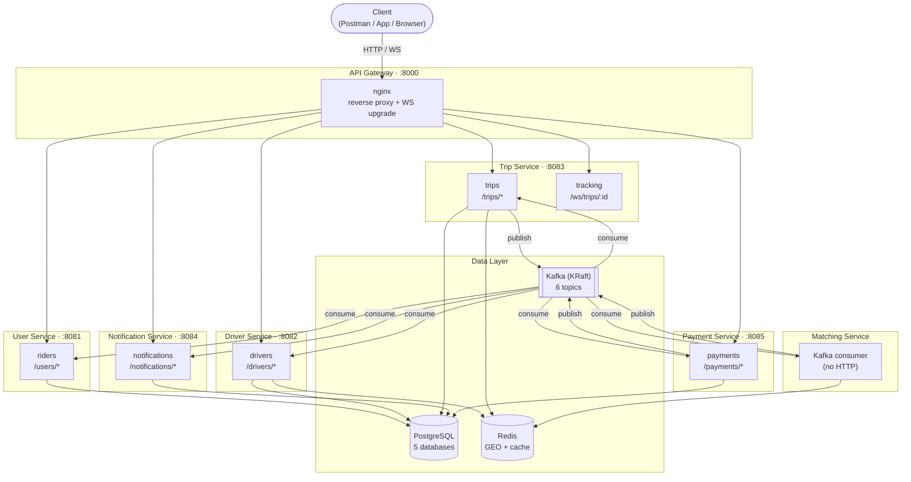

# Uber Ride-Hailing Backend

Production-grade distributed ride-hailing system built with **Go microservices**, event-driven architecture (Kafka), geospatial matching (Redis), and PostgreSQL — orchestrated via Docker Compose with an NGINX API gateway.

## Architecture


```mermaid
flowchart TD
    Client(["Client\n(Postman / App / Browser)"])

    subgraph Gateway["API Gateway · :8000"]
        Nginx["nginx\nreverse proxy + WS upgrade"]
    end

    subgraph UserSvc["User Service · :8081"]
        U["riders\n/users/*"]
    end
    subgraph DriverSvc["Driver Service · :8082"]
        D["drivers\n/drivers/*"]
    end
    subgraph TripSvc["Trip Service · :8083"]
        T["trips\n/trips/*"]
        WS["tracking\n/ws/trips/:id"]
    end
    subgraph MatchSvc["Matching Service"]
        M["Kafka consumer\n(no HTTP)"]
    end
    subgraph NotifSvc["Notification Service · :8084"]
        N["notifications\n/notifications/*"]
    end
    subgraph PaySvc["Payment Service · :8085"]
        P["payments\n/payments/*"]
    end

    subgraph Data["Data Layer"]
        PG[("PostgreSQL\n5 databases")]
        Redis[("Redis\nGEO + cache")]
        Kafka[["Kafka (KRaft)\n6 topics"]]
    end

    Client -->|HTTP / WS| Nginx
    Nginx --> U & D & T & WS & N & P

    U --> PG
    D --> PG & Redis
    T --> PG & Redis
    N --> PG
    P --> PG

    T -->|publish| Kafka
    P -->|publish| Kafka
    Kafka -->|consume| M & D & U & N & P & T
    M --> Redis
    M -->|publish| Kafka
```

### Kafka Event Flow

```
POST /trips-service/request
        │
        ▼
  ride.requested ──► Matching consumer
                          │ (finds nearest driver via Redis GEO)
                          ▼
                  driver.assigned ──► trip-service (updates trip)
                                 ──► driver-service (sets status=busy)
                                 ──► notification-service

PATCH /trips/:id/end
        │
        ▼
  trip.completed ──► payment-service (creates payment)
                 ──► driver-service (sets status=available)
                 ──► notification-service

POST /trips/:id/rate
        │
        ▼
  rating.submitted ──► driver-service (updates avg rating)
                   ──► user-service (updates avg rating)
                   ──► notification-service

Payment processing complete
        │
        ▼
  payment.completed ──► notification-service
```

## Features

- **JWT Authentication** — access tokens (24h) + refresh tokens (7d)
- **Role-Based Access Control** — rider and driver roles with endpoint-level enforcement
- **Automated Ride Matching** — Kafka-driven matching via Redis GEO proximity search
- **Fare Estimation** — pre-trip Haversine-based fare calculator with surge multiplier
- **Trip Lifecycle** — full state machine: REQUESTED → DRIVER_ASSIGNED → STARTED → COMPLETED / CANCELLED
- **Rating System** — riders and drivers rate each other post-trip; weighted average recalculation
- **Notifications** — event-driven notifications for all trip lifecycle events
- **Payments** — automatic payment creation on trip completion with async processing
- **WebSocket Tracking** — real-time location streaming per trip
- **Ride History** — paginated trip/payment history with role-based filtering

## Services & Ports

| Service | Port | Database | Description |
|---------|------|----------|-------------|
| **api-gateway** | 8000 | — | NGINX reverse proxy, routes to all services |
| **user-service** | 8081 | users_db | Rider registration, login, refresh tokens, profile |
| **driver-service** | 8082 | drivers_db | Driver registration, login, location, status, nearby search |
| **trip-service** | 8083 | trips_db | Trip lifecycle, fare estimation, ratings, WebSocket tracking |
| **matching-service** | — | — | Kafka consumer: matches riders with nearest available drivers |
| **notification-service** | 8084 | notifications_db | Consumes all events, creates user notifications |
| **payment-service** | 8085 | payments_db | Auto-creates payments on trip completion |
| PostgreSQL | 5433 | — | 5 databases, one per service |
| Redis | 6380 | — | GEO driver locations + trip cache |
| Kafka | 9093 | — | KRaft mode, 6 topics |

## Kafka Topics

| Topic | Publisher | Consumer(s) |
|-------|-----------|-------------|
| `ride.requested` | trip-service | matching-service |
| `driver.assigned` | matching-service | trip-service, driver-service, notification-service |
| `trip.completed` | trip-service | driver-service, payment-service, notification-service |
| `trip.cancelled` | trip-service | driver-service, notification-service |
| `rating.submitted` | trip-service | driver-service, user-service, notification-service |
| `payment.completed` | payment-service | notification-service |

## Project Structure

```
uber/
├── go.work                          # Go workspace (7 modules)
├── shared/                          # Shared libraries (uber/shared)
│   ├── pkg/
│   │   ├── db/postgres.go           # pgx pool + migration runner
│   │   ├── kafka/client.go          # producer + consumer + topic management
│   │   ├── redis/client.go          # GEO set + location backup + trip cache
│   │   ├── jwt/jwt.go               # HS256 JWT with access + refresh tokens
│   │   └── validation/              # Input validation helpers
│   └── events/events.go             # Event structs for all 6 topics
├── user-service/                    # :8081, riders
├── driver-service/                  # :8082, drivers + Kafka status consumers
├── trip-service/                    # :8083, trips + ratings + WebSocket
├── matching-service/                # Kafka-only, no HTTP
├── notification-service/            # :8084, event-driven notifications
├── payment-service/                 # :8085, auto payments
├── api-gateway/                     # NGINX config + Dockerfile
├── infra/
│   ├── docker-compose.yml           # 10 containers
│   ├── init.sql                     # Creates 5 databases
│   └── .env.example
├── test/
│   └── test_all.sh                  # E2E test suite
└── Makefile
```

## Quick Start

```bash
# Clone and start
git clone <repo-url> && cd uber
cp infra/.env.example infra/.env     # edit secrets
make up                               # build & start all containers

# Wait ~30-45s for Kafka + Postgres, then services auto-connect and run migrations
make logs                             # tail all service logs
```

### Verify

```bash
# Health checks
curl -s http://localhost:8081/health | jq   # user-service
curl -s http://localhost:8082/health | jq   # driver-service
curl -s http://localhost:8083/health | jq   # trip-service
curl -s http://localhost:8084/health | jq   # notification-service
curl -s http://localhost:8085/health | jq   # payment-service
```

---

## API Reference

All requests go through the gateway at **http://localhost:8000**. Every response is JSON.

### User Service — `/users`

| Method | Path | Auth | Description |
|--------|------|------|-------------|
| POST | `/users/register` | — | Register a rider |
| POST | `/users/login` | — | Login as rider |
| POST | `/users/refresh` | — | Refresh access token |
| GET | `/users/{id}` | Bearer (rider) | Get rider profile |

### Driver Service — `/drivers`

| Method | Path | Auth | Description |
|--------|------|------|-------------|
| POST | `/drivers/register` | — | Register a driver |
| POST | `/drivers/login` | — | Login as driver |
| POST | `/drivers/refresh` | — | Refresh access token |
| GET | `/drivers/{id}` | Bearer (driver) | Get driver profile |
| PATCH | `/drivers/{id}/location` | Bearer (driver) | Update GPS location |
| PATCH | `/drivers/{id}/status` | Bearer (driver) | Go online/offline |
| GET | `/drivers/nearby` | Bearer (driver) | Find nearby drivers |

### Trip Service — `/trips`

| Method | Path | Auth | Description |
|--------|------|------|-------------|
| POST | `/trips/request` | Bearer (rider) | Request a ride |
| POST | `/trips/estimate` | Bearer (rider) | Get fare estimate |
| GET | `/trips/history` | Bearer | Paginated trip history |
| GET | `/trips/{id}` | Bearer | Get trip details (owner only) |
| PATCH | `/trips/{id}/assign` | Bearer | Manually assign driver |
| PATCH | `/trips/{id}/start` | Bearer (driver) | Start trip |
| PATCH | `/trips/{id}/end` | Bearer (driver) | End trip + compute fare |
| PATCH | `/trips/{id}/cancel` | Bearer | Cancel trip |
| POST | `/trips/{id}/rate` | Bearer | Rate rider/driver (1-5) |
| WS | `/ws/trips/{id}` | — | Real-time location tracking |

### Notification Service — `/notifications`

| Method | Path | Auth | Description |
|--------|------|------|-------------|
| GET | `/notifications/` | Bearer | Paginated notification list |
| PATCH | `/notifications/{id}/read` | Bearer | Mark notification as read |

### Payment Service — `/payments`

| Method | Path | Auth | Description |
|--------|------|------|-------------|
| GET | `/payments/history` | Bearer | Paginated payment history |
| GET | `/payments/{tripId}` | Bearer | Get payment by trip (owner only) |

---

### Example: Register Rider

```bash
curl -s -X POST http://localhost:8000/users/register \
  -H "Content-Type: application/json" \
  -d '{
    "name": "Sai Kumar",
    "email": "sai@test.com",
    "phone": "+919999999999",
    "password": "Pass123!"
  }' | jq
```

```json
{
  "token": "eyJhbGciOi...",
  "refresh_token": "eyJhbGciOi...",
  "user": { "id": "...", "name": "Sai Kumar", "email": "sai@test.com", "rating": 5 }
}
```

### Example: Fare Estimate

```bash
curl -s -X POST http://localhost:8000/trips/estimate \
  -H "Authorization: Bearer $RIDER_TOKEN" \
  -H "Content-Type: application/json" \
  -d '{"pickupLat":12.9716,"pickupLng":77.5946,"dropLat":12.9352,"dropLng":77.6245}' | jq
```

```json
{
  "estimated_fare": 104.00,
  "estimated_distance": 4.50,
  "estimated_duration": 10.80,
  "surge_multiplier": 1.0,
  "currency": "INR"
}
```

---

## End-to-End Flow

```bash
# 1. Register rider + driver
RIDER=$(curl -s -X POST http://localhost:8000/users/register \
  -H "Content-Type: application/json" \
  -d '{"name":"Test Rider","email":"rider@e2e.com","phone":"+911111111111","password":"Pass123!"}')
RIDER_TOKEN=$(echo $RIDER | jq -r '.token')

DRIVER=$(curl -s -X POST http://localhost:8000/drivers/register \
  -H "Content-Type: application/json" \
  -d '{"name":"Test Driver","email":"driver@e2e.com","phone":"+912222222222","password":"Pass123!","vehicle_type":"sedan","license_plate":"KA-99-ZZ-0001"}')
DRIVER_TOKEN=$(echo $DRIVER | jq -r '.token')
DRIVER_ID=$(echo $DRIVER | jq -r '.driver.id')

# 2. Set driver location
curl -s -X PATCH http://localhost:8000/drivers/$DRIVER_ID/location \
  -H "Authorization: Bearer $DRIVER_TOKEN" \
  -H "Content-Type: application/json" \
  -d '{"lat": 12.9716, "lng": 77.5946}' | jq

# 3. Request ride → auto-matched via Kafka
TRIP=$(curl -s -X POST http://localhost:8000/trips/request \
  -H "Authorization: Bearer $RIDER_TOKEN" \
  -H "Content-Type: application/json" \
  -d '{"pickupLat":12.9716,"pickupLng":77.5946,"dropLat":12.9352,"dropLng":77.6245}')
TRIP_ID=$(echo $TRIP | jq -r '.trip_id')

# 4. Wait for matching, verify assignment
sleep 5
curl -s http://localhost:8000/trips/$TRIP_ID \
  -H "Authorization: Bearer $RIDER_TOKEN" | jq '{status, driver_id}'

# 5. Start → End trip
curl -s -X PATCH http://localhost:8000/trips/$TRIP_ID/start \
  -H "Authorization: Bearer $DRIVER_TOKEN" | jq '{status}'
curl -s -X PATCH http://localhost:8000/trips/$TRIP_ID/end \
  -H "Authorization: Bearer $DRIVER_TOKEN" \
  -H "Content-Type: application/json" -d '{}' | jq '{status, fare}'

# 6. Rate driver + check notifications + payment
curl -s -X POST http://localhost:8000/trips/$TRIP_ID/rate \
  -H "Authorization: Bearer $RIDER_TOKEN" \
  -H "Content-Type: application/json" \
  -d '{"score":5,"comment":"Great ride!"}' | jq

sleep 2
curl -s http://localhost:8000/notifications/ \
  -H "Authorization: Bearer $RIDER_TOKEN" | jq '.notifications[].title'
curl -s http://localhost:8000/payments/$TRIP_ID \
  -H "Authorization: Bearer $RIDER_TOKEN" | jq '{status, amount}'
```

## Trip Status Lifecycle

```
REQUESTED ──► (Kafka matching) ──► DRIVER_ASSIGNED ──► STARTED ──► COMPLETED
    │                                    │                              │
    ├── manual /assign ──────────────────┘                              ├── payment auto-created
    │                                                                   ├── notifications sent
    └── /cancel ──► CANCELLED                                           └── rating available
                        │
                        └── driver restored to GEO pool
```

## Fare Formula

```
fare = (₹50 base + ₹12 × distance_km) × surge_multiplier
```

| Distance | Fare (1x surge) |
|----------|-----------------|
| 4.5 km | ₹104 |
| 10 km | ₹170 |
| 25.5 km | ₹356 |

## JWT Authentication

- **Access token**: 24-hour expiry, included as `Authorization: Bearer <token>`
- **Refresh token**: 7-day expiry, use `POST /users/refresh` or `/drivers/refresh`
- **Roles**: `rider` (user endpoints) and `driver` (driver endpoints)
- **Public endpoints**: `/health`, `register`, `login`, `refresh` on user/driver services

## Testing

```bash
# Unit tests (32 tests across 5 service packages + shared)
go test ./shared/... ./user-service/... ./driver-service/... \
  ./trip-service/... ./notification-service/... ./payment-service/...

# E2E integration tests (requires running containers)
bash test/test_all.sh
```

## Tech Stack

| Component | Technology | Purpose |
|-----------|-----------|---------|
| Language | Go 1.21+ | All 7 modules |
| Router | chi/v5 | HTTP routing + middleware |
| Database | PostgreSQL + pgx/v5 | 5 separate databases with connection pooling |
| Cache/GEO | Redis + go-redis/v9 | Driver proximity search + location backup |
| Events | Kafka (KRaft) + kafka-go | 6 topics, event-driven architecture |
| Auth | HS256 JWT | Access tokens + refresh tokens + RBAC |
| WebSocket | gorilla/websocket | Real-time trip tracking |
| Gateway | NGINX | Reverse proxy + WebSocket upgrade |
| Infra | Docker Compose | 10 containers orchestration |
| Passwords | bcrypt | Secure password hashing |

## Teardown

```bash
make down      # stop containers
make clean     # stop + wipe all volumes
```
